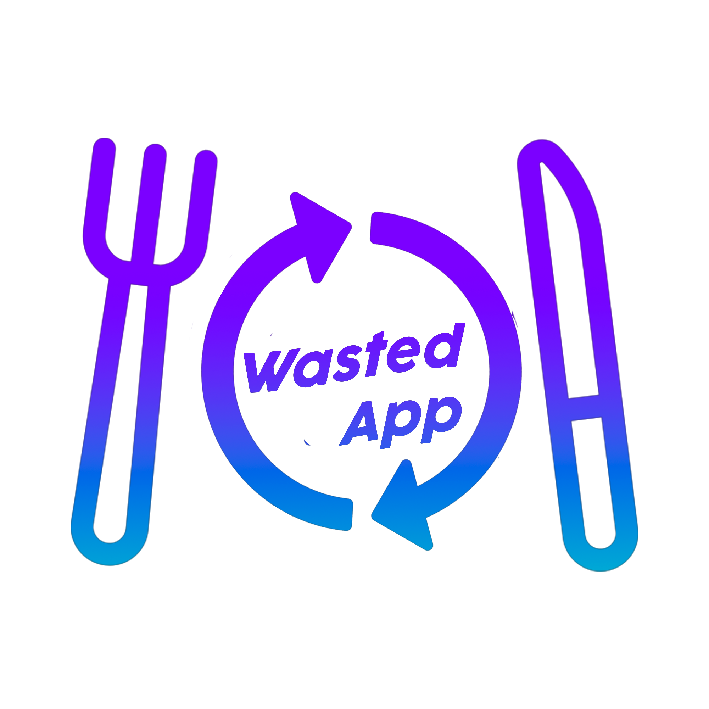

# About

Our application "Wasted" solves the problem of restaurants/markets/shops throwing out tons of good food every day simply because they didn't use it all. We tackled this issue by creating an application where businesses can upload food which they are going to throw in the trash. Users can then see what food items are available near them and go and buy them for a much cheaper price.

# Setup

## Frontend
Check it [here](./frontend)

## Backend
Check it [here](./backend)

# Demo

## Restaurant view 
[See on YouTube](https://youtube.com/shorts/3nAZQARH2Vs?feature=share)

## Consumer view
[See on YouTube](https://youtube.com/shorts/eCRXE-bRb4I?feature=share)

# Are you a restaurant?
Your feedback is important for us! Participe in [this questionnaire](https://forms.gle/8GJLD3RzGmnRG12N8)
