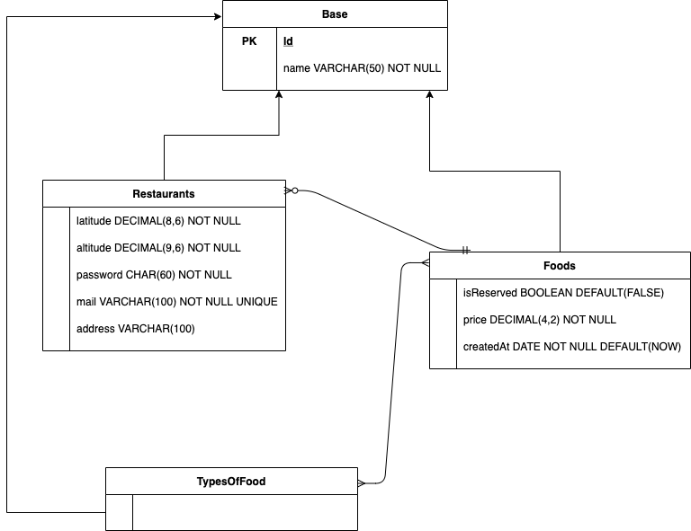

# Documentation DB

## Tables
* Base: all entities are a base entity. 
    * Id: unique identifier
    * Name: name of the entity
* TypesOfFood: represents all the types of food. There is a default type
for unclassified meals.
* Restaurants: represents the restaurants registered in the app.
    * Address: name of the street of the restaurant.
    * Coords:
        * latitude: latitude of the restaurant's ubication.
        * altitude: altitude of the restaurant's ubication.
    * Credentials
        * password: password for the login. It can be changed and it will be encrypted.
        * mail: mail to identify the user.
* Foods: represents the shipments. A restaurant can upload a new meal (food) so that a user can see the restaurant's ubication and pick it up.
    * price: price of the meal.
    * createdAt: when the restaurant uploaded the meal to the platform.
    * idRestaurant: extern key to identify the restaurant.
    * idTypeOfFood: extern key to identify the type of food.

## Entity-Relationship Diagram
A restaurant can register and login to the app with its email and password. Then, it can upload food, which will be visible to the users. 
A food can only exists if the restaurant uploaded it, and can only be owned by a restaurant.
A meal can have zero or one type of food.

