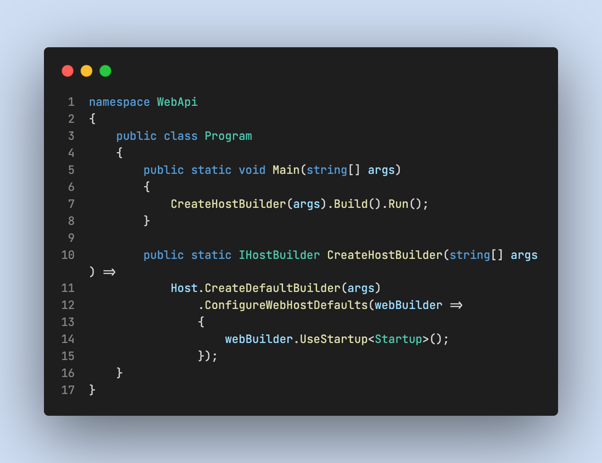

# Start up

## Host
[More info](https://docs.microsoft.com/en-us/aspnet/core/fundamentals/host/generic-host?view=aspnetcore-5.0)

A host is an object that encapsulates the app's resources:
- Dependency injection (DI)
- Logging
- Configuration
- IHostedService implementations

### ❓ Why
The main reason for including all of the app's interdependent resources in one object is lifetime management: control over app startup and graceful shutdown.

## Build

To create an API, we need to create an implementation of an IHostService that represents a web service.
This is the default way to build a HTTP server in ASP net
The most relevant thing here is the use of the Startup class, which have two methods:
- **ConfigureServices**: to add services to the container. We use this method to add Swagger, all the controllers and to implement dependency injection.
- **Configure**: to configure the HTTP request pipeline

## Dependency injection

[More info](https://docs.microsoft.com/en-us/dotnet/core/extensions/dependency-injection)

**Add{LIFETIME}<{INTERFACE}, {IMPLEMENTATION}>()**

Services can be registered with one of the following lifetimes:
- Transient
- Scoped
- Singleton

### Comparison between lifetimes
All these methods are applied to a IServiceCollection, which contains all the services to be used in the server:
- AddTransient<Interface, Implementation> 
    
    ℹ️ Services are created each time they're requested. 

    👍🏻 Best for lightweight, stateless services.

- AddScoped<Interface, Implementation>     
    
    ℹ️ Services are created once per client request (connection).

    👍🏻 Better option when you want to maintain state within a request.

- AddSingleton<Interface, Implementation> 
    
    ℹ️ Services are created the first time they're requested.
