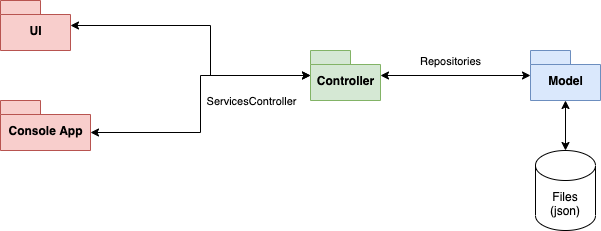

# Documentation classes diagram

## Package diagram

The idea is to use the MVC pattern.
* Model: manages the access to information.
* View: in this case the view is the frontend. In future iterations it could be the API. It is the endpoint that allow the user to interact with the system.
* Controller: manages the logic and the communication between the view and the model.

## Project structure
* Controller: its responsability is to introduce logic in the management of information, so that the user can work with the program without breaking any business rule.
    * Entities: all the objects used in the application.
        * Information objects: most important objects. They should be stored.
            * **BaseEntity.cs**: base object from which the rest will be descendent.
            * Food.cs: represents each meal in the application.
            * Restaurant.cs: represents the restaurant entity.
            * TypeOfFood.cs: represents a type of food, which will be useful to filter the meals in the app.
        * Others: used by the objects from above.
            * Coords.cs: stores the longitude and latitude of an ubication.
            * Credentials.cs: stores the mail and password.
            * Mail.cs: represents an email. It should have methods to validate the user's input.
            * Password.cs: represents a password. It should have methods to validate the user's input.
    * Interfaces: to avoid an implementation's dependency, we use interfaces. 
        * Repositories: contract that allow the controller to communicate with the model package.
            * IBaseRepository.cs: base operations, CRUD. All below interfaces are descendent from this one. It is generic, so only objects of BaseEntity type and descendents are able to be managed throughout this interface.
            * IFoodRepository.cs: operations with the food repository.
            * IRestaurantRepository.cs: operations with restaurant repository.
            * ITypeOfFoodRepository.cs: operations with typeOfFood repository.
        * Services: contract that allow the frontend to communicate with the controller.
            * IAuthService.cs: contract that requires an implementation of registration, login, sign off methods.
            * IFoodService.cs: contract that contains the methods that can be called in the UI to interact with the food.
            * IRestaurantService.cs: contract that contains the methods that can be called in the UI to interact with the restaurants.
            * ITypeOfFoodService.cs: contract that contains the methods that can be called in the UI to interact with the types of food.
    * Services: classes that implements the services's interfaces. They allow to communicate the frontend with the controller.
        * FoodService.cs.
        * RestaurantService.cs.
        * TypeOfFoodService.cs.
    * **ServicesController.cs**: singleton class. It is the most important class of the controller. It is the iniciator of the repositories and services.
* Model: its responsability is to manage the access to information.
    * Data: 
        * DBConfiguration.cs: singleton class. Its responsability is to read the configuration file to allow the ServicesController initialize the repositories.
    * Repositories: classes to manage the information access.
        * BaseRepository.cs.
        * FoodRepository.cs.
        * RestaurantRepository.cs.
        * TypeOfFoodRepository.cs.

## Future goals
* Use DTO
* Unit of Work
* Encrypt/Decrypt password
* Role management
* Migrate to databases
* Dependency injection: json management